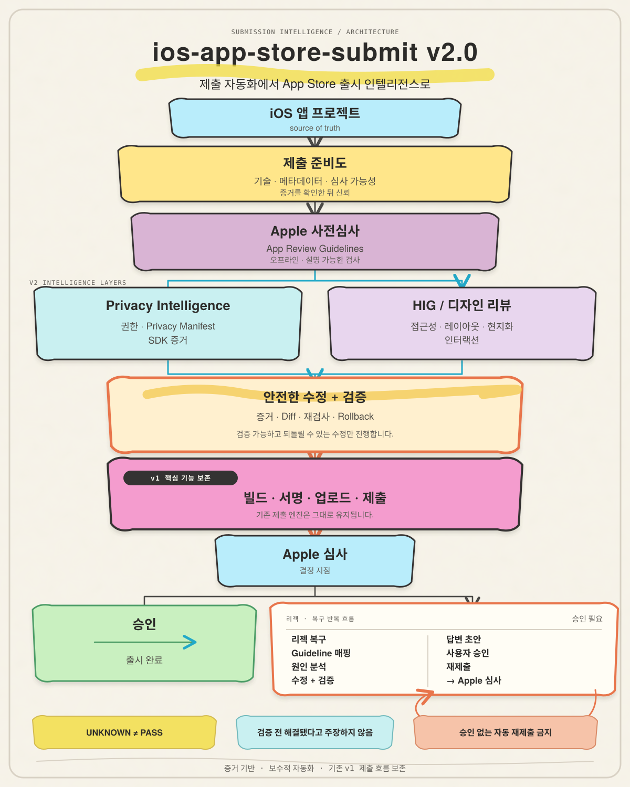

# ios-app-store-submit

[🇺🇸 English](README.md) | [🇰🇷 한국어](README.ko.md)


> **iOS 앱을 제출하는 도구에서, 제출해도 되는지 먼저 판단하고 리젝 이후까지 복구하는 Release Intelligence 도구로.**

`ios-app-store-submit`은 기존 **Archive → Upload → Submit** 자동화를 보존하면서, 제출 전에 Readiness, Apple Review Guidelines, Privacy, HIG/Design 관점에서 앱을 검사하는 도구입니다.

이 프로젝트는 새로운 저장소가 아니라 기존 `ios-app-store-submit`의 진화형입니다. 공개 릴리스 목표는 **v2.0.0**입니다.

## v2 아키텍처



v2는 기존 빌드·서명·업로드·제출 흐름을 그대로 보존하면서, Apple 심사 전후에 증거 기반 인텔리전스 계층을 추가합니다.

## 현재 상태

| 영역 | 상태 | 설명 |
|---|---|---|
| Readiness Core | ✅ | Technical / Metadata / Reviewability |
| Safe Auto-Fix | ✅ | Plan → Apply → Verify → Rollback |
| Apple Pre-Review | ✅ | App Review Guidelines 기반 사전검사 |
| Privacy Intelligence | ✅ | 권한, Privacy Manifest, SDK, 네트워크 증거 |
| HIG / Design Review | ✅ | Accessibility, Layout, Localization, Interaction |
| Rejection Recovery | ✅ | 리젝 분석 → 원인 → 수정계획 → 검증 → 답변 초안 |
| Closed-loop Resubmission | ✅ | 사용자 승인과 증거에 묶인 재제출 orchestration |

v2.0.0은 7개 Phase를 read-only 검사와 명시적 외부 변경 승인 경계로 연결합니다.

## 기존 버전과 무엇이 다른가?

기존 흐름:

```text
Archive → Validate → Upload → Submit
```

현재 고도화 흐름:

```text
App Project
    ↓
Readiness
    ↓
Apple Pre-Review
    ↓
Privacy Intelligence
    ↓
HIG / Design Review
    ↓
Safe Fix → Verify
    ↓
Archive → Upload → Submit
    ↓
Apple Review
    ↓
Rejection Recovery
    ↓
Verify → User Approval → Resubmit → Verify
```

핵심은 **Apple에 보내기 전에 스스로 한 번 심사하는 것**입니다.

## 설계 원칙

### Evidence before confidence
증거가 없으면 통과로 간주하지 않습니다.

```text
UNKNOWN ≠ PASS
```

### Safe fixes only
Bundle ID, signing, certificate/provisioning, Privacy 의미, 사용자 콘텐츠, UI 의미, navigation, 법적 문구 등 위험하거나 의미를 바꾸는 항목은 임의로 자동 수정하지 않습니다.

### Verify before claim
리젝 복구에서는 검증 없이 Apple에 `Fixed`, `Resolved`라고 주장하지 않습니다.

### No external mutation by inspection
검사 모드는 기본적으로 네트워크 호출, App Store Connect 변경, signing 변경, 제출을 실행하지 않습니다.

## 설치

기존 저장소를 Claude Code skill 디렉토리에 클론합니다.

```bash
mkdir -p ~/.agents/skills
git clone https://github.com/ZestfulPulse/ios-app-store-submit.git ~/.agents/skills/ios-app-store-submit
ln -s ../../.agents/skills/ios-app-store-submit ~/.claude/skills/ios-app-store-submit
```

이 저장소는 전체 제출 workflow를 위한 Claude Code skill입니다. Claude Code는 `~/.claude/skills/` 아래의 skill을 자동으로 찾으므로 모든 Flutter/iOS 프로젝트에서 사용할 수 있습니다.

## 사전 준비물

- 필요한 App Store Connect 권한이 있는 Apple Developer Program 멤버십
- 로컬 Xcode와 Flutter
- [`asc` CLI](https://github.com/rorkai/app-store-connect-cli-skills)
- `~/.asc/keys/`에 제한된 권한으로 보관한 App Store Connect API key. 자격증명은 report나 command에 넣지 않습니다.

헤드리스 signing은 번들된 `scripts/setup_build_keychain.sh`와 전용 build keychain을 사용합니다. 기존 skill의 archive/export/upload 절차는 그대로 유지되며, readiness 검사에서 signing/provisioning 변경을 추론하지 않습니다.

## 사용법

Claude Code에 다음과 같이 자연어로 요청할 수 있습니다.

> “이 앱을 App Store Connect에 빌드하고 제출해줘.”
> “readiness와 Apple pre-review를 실행해줘.”
> “이 rejection을 분석하고 검증된 재제출 plan을 준비해줘.”

## 빠른 시작

기본 검사:

```bash
python3 scripts/readiness_check.py /path/to/your/app
```

권장 전체 사전검사:

```bash
python3 scripts/readiness_check.py \
  /path/to/your/app \
  --pre-review \
  --privacy \
  --design
```

JSON 출력:

```bash
python3 scripts/readiness_check.py \
  /path/to/your/app \
  --pre-review \
  --privacy \
  --design \
  --json
```

## 결과 읽기

| 상태 | 의미 |
|---|---|
| `PASS` | 구현된 검사 범위에서 문제가 확인되지 않음 |
| `RISK` | 검토할 위험 신호 |
| `UNKNOWN` | 판단에 필요한 증거 부족 |
| `BLOCKED` | 결정적인 제출 전 문제 발견 |

`PASS`는 Apple 승인 보장이 아닙니다.

## 주요 기능

### Readiness Core
Technical readiness, Metadata, Reviewability를 evidence/provenance와 함께 검사합니다.

### Safe Auto-Fix

```text
Finding → Fix Plan → Diff → Apply → Verify
                                  ↓
                            실패 시 Rollback
```

Stale-plan 감지와 before/after hash evidence를 사용합니다.

### Apple Pre-Review
Apple Review Guidelines를 정규화한 offline rule registry를 사용합니다. 현재 Performance, Metadata, Privacy, Review Access를 다루며 heuristic만으로 BLOCK하지 않습니다.

### Privacy Intelligence
다음을 로컬에서 분석합니다.

- `Info.plist` permissions
- `PrivacyInfo.xcprivacy`
- Required Reason API evidence
- SDK / package dependencies
- Network/backend signals
- Privacy Policy evidence

권한 접근과 데이터 수집을 구분합니다.

```text
Location permission present
→ ACCESS = YES
→ COLLECTION = UNKNOWN
→ TRACKING = UNKNOWN
```

### HIG / Design Review
현재 Accessibility, Layout, Localization, Interaction을 검사합니다. 실제 렌더링이 필요한 내용은 억지로 PASS시키지 않고 `UNKNOWN`으로 남깁니다.

## Rejection Recovery

목표 흐름:

```text
Apple Rejection
  ↓
Parse
  ↓
Guideline / Privacy / HIG Mapping
  ↓
Root Cause
  ↓
Fix Plan
  ↓
Verification
  ↓
Reply Draft
```

사용 형태:

```bash
python3 scripts/readiness_check.py \
  /path/to/your/app \
  --rejection /path/to/rejection.txt
```

검증되지 않은 수정은 reviewer-facing 답변에서 해결 완료로 주장하지 않습니다.

## Closed-loop Resubmission

Phase 7은 복구 이후 재제출까지의 loop를 완성합니다.

```text
Inspect → Pre-Review → Privacy → Design → Fix → Verify → Submit
  → Review → Recover → Verify → User Approval → Resubmit
```

Phase 6 recovery report에서 read-only plan을 만듭니다.

```bash
python3 scripts/readiness_check.py \
  /path/to/your/app \
  --resubmit-plan /path/to/recovery-report.json
```

발견된 App Store Connect ID, command preview, blocker, approval status, binding digest를 출력하며 외부 변경은 0회입니다. 승인 artifact를 별도로 기록한 뒤 동일한 digest로만 실행합니다.

```bash
python3 scripts/readiness_check.py \
  /path/to/your/app \
  --resubmit-plan /path/to/recovery-report.json \
  --approve-resubmit \
  --approval-digest PLAN_DIGEST

python3 scripts/readiness_check.py \
  /path/to/your/app \
  --resubmit-plan /path/to/recovery-report.json \
  --execute-resubmit \
  --approval-digest PLAN_DIGEST
```

자동 재제출은 없습니다. build, version, reply, fix evidence 또는 plan digest가 바뀌면 승인은 stale이 됩니다. 실행에는 모든 gate, `ready_to_send`, `WAITING_FOR_REVIEW` 또는 `IN_REVIEW` 같은 post-submit 상태 검증이 필요합니다.

## 실제 제출

기존 submission workflow는 그대로 보존합니다.

```text
asc xcode archive
asc publish appstore
asc review submit
```

새 Intelligence 계층은 이 제출 엔진을 대체하지 않고 앞뒤에 안전장치를 추가합니다.

## 안전 경계

검사 과정에서 자동으로 수행하지 않는 작업:

- App Store Connect mutation
- Apple review submission
- GitHub mutation
- certificate / provisioning / signing 변경
- App Privacy 답변 게시
- 위험한 UI/Privacy 의미 변경
- 자동 재제출 — 항상 명시적인 사용자 승인이 필요함

## Roadmap

```text
Phase 1  Readiness Core             ✅
Phase 2  Safe Auto-Fix              ✅
Phase 3  Apple Pre-Review           ✅
Phase 4  Privacy Intelligence       ✅
Phase 5  HIG / Design Review        ✅
Phase 6  Rejection Recovery         ✅
Phase 7  Closed-loop Resubmission   ✅
```

최종 목표:

```text
Inspect → Fix → Verify → Submit
                       ↓
                  Apple Review
                    ↙       ↘
               Approved   Rejected
                             ↓
                          Recover
                             ↓
                           Verify
                             ↓
                        User Approval
                             ↓
                          Resubmit
```

## 프로젝트 철학

App Store 자동화에서 가장 위험한 것은 자동화가 적은 것이 아니라 **자동화가 모르는 것을 안다고 생각하는 것**입니다.

- 증거가 있으면 판정합니다.
- 부족하면 `UNKNOWN`으로 남깁니다.
- 안전한 수정만 자동화합니다.
- 검증 전에는 해결됐다고 주장하지 않습니다.
- 외부 변경에는 명확한 승인 경계를 둡니다.

## 번들 스크립트

- `scripts/readiness_check.py` — readiness, pre-review, privacy, design, recovery, resubmission plan gate를 read-only로 실행합니다.
- `scripts/gen_app_icons.py` — 하나의 PNG에서 launcher icon 크기를 재생성합니다.
- `scripts/setup_build_keychain.sh` — 헤드리스 signing용 전용 keychain을 생성하고 잠금해제합니다.

## License

저장소의 라이선스 파일을 참고하세요.
