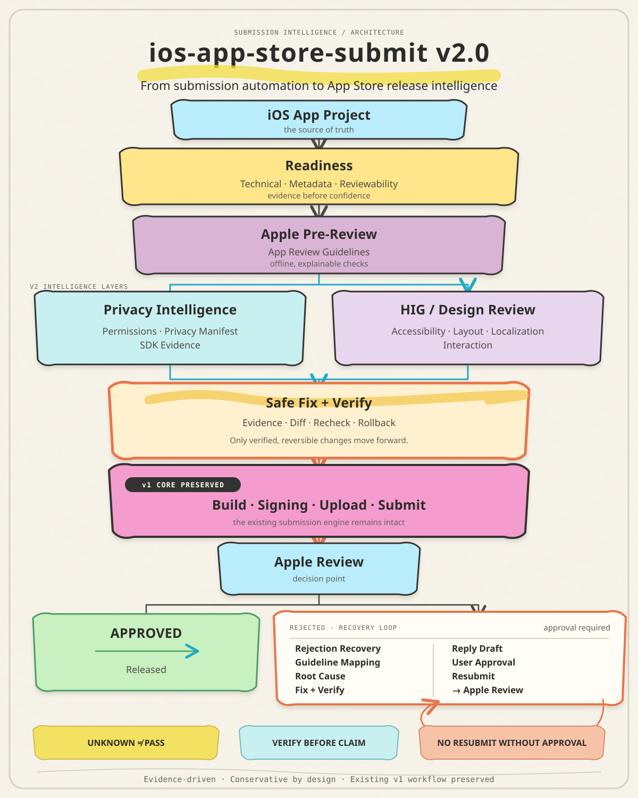

# ios-app-store-submit

[🇺🇸 English](README.md) | [🇰🇷 한국어](README.ko.md)


> **From automating App Store submission to deciding whether an iOS app is actually ready to submit, and helping recover when review fails.**

`ios-app-store-submit` preserves the existing **Archive → Upload → Submit** workflow while adding evidence-driven Readiness, Apple Review Guidelines, Privacy, and HIG/Design checks before submission.

This is the evolution of ios-app-store-submit, not a new repository. The public release target is **v2.0.0**.

## v2 Architecture



v2 preserves the original build, signing, upload, and submission workflow while adding evidence-driven intelligence before and after App Review.

## Current Status

| Area | Status | Description |
|---|---|---|
| Readiness Core | ✅ | Technical / Metadata / Reviewability |
| Safe Auto-Fix | ✅ | Plan → Apply → Verify → Rollback |
| Apple Pre-Review | ✅ | App Review Guidelines preflight |
| Privacy Intelligence | ✅ | Permissions, Privacy Manifest, SDK and network evidence |
| HIG / Design Review | ✅ | Accessibility, Layout, Localization, Interaction |
| Rejection Recovery | ✅ | Rejection → cause → fix plan → verification → reply draft |
| Closed-loop Resubmission | ✅ | User-approved, evidence-bound resubmission orchestration |

The v2.0.0 release combines all seven phases behind read-only inspection and explicit external-mutation gates.

## What Makes It Different?

Traditional submission automation:

```text
Archive → Validate → Upload → Submit
```

The enhanced workflow:

```text
App Project
    ↓
Readiness
    ↓
Apple Pre-Review
    ↓
Privacy Intelligence
    ↓
HIG / Design Review
    ↓
Safe Fix → Verify
    ↓
Archive → Upload → Submit
    ↓
Apple Review
    ↓
Rejection Recovery
    ↓
Verify → User Approval → Resubmit → Verify
```

The core idea is simple: **review the app before sending it to Apple.**

## Design Principles

### Evidence before confidence
Missing evidence is not treated as success.

```text
UNKNOWN ≠ PASS
```

### Safe fixes only
Risky or semantic changes such as bundle identifiers, signing, certificates/provisioning, privacy semantics, user-authored content, UI semantics, navigation, and legal copy are not silently changed.

### Verify before claim
Rejection recovery must not tell a reviewer that an issue is `Fixed` or `Resolved` without supporting verification evidence.

### No external mutation by inspection
Inspection modes do not perform network calls, mutate App Store Connect, change signing state, or submit the app by default.

## Install

Clone the existing repository into the Claude Code skill directory:

```bash
mkdir -p ~/.agents/skills
git clone https://github.com/ZestfulPulse/ios-app-store-submit.git ~/.agents/skills/ios-app-store-submit
ln -s ../../.agents/skills/ios-app-store-submit ~/.claude/skills/ios-app-store-submit
```

This is the Claude Code skill for the complete workflow. Claude Code discovers skills under `~/.claude/skills/`, so the same skill can be used from any iOS or Flutter project.

## Prerequisites

- Apple Developer Program membership with appropriate App Store Connect access
- Xcode and Flutter installed locally
- The [`asc` CLI](https://github.com/rorkai/app-store-connect-cli-skills)
- An App Store Connect API key stored locally under `~/.asc/keys/` with restrictive permissions; never place credentials in reports or commands

Headless signing uses a dedicated build keychain and the bundled `scripts/setup_build_keychain.sh`. Archive/export/upload still follow the existing skill guidance; signing and provisioning changes are never inferred by readiness inspection.

## Use

Ask Claude Code naturally, for example:

> “Build and submit this app to App Store Connect.”
> “Run the readiness and Apple pre-review checks.”
> “Analyze this rejection and prepare a verified resubmission plan.”

## Quick Start

Basic inspection:

```bash
python3 scripts/readiness_check.py /path/to/your/app
```

Recommended full pre-submission inspection:

```bash
python3 scripts/readiness_check.py \
  /path/to/your/app \
  --pre-review \
  --privacy \
  --design
```

Machine-readable JSON:

```bash
python3 scripts/readiness_check.py \
  /path/to/your/app \
  --pre-review \
  --privacy \
  --design \
  --json
```

## Understanding Results

| Status | Meaning |
|---|---|
| `PASS` | No issue found within the implemented inspection scope |
| `RISK` | A risk signal deserves review |
| `UNKNOWN` | Required evidence is missing |
| `BLOCKED` | A deterministic pre-submission problem was found |

A `PASS` is not a guarantee of App Store approval.

## Core Features

### Readiness Core
Inspects technical readiness, metadata, and reviewability with evidence and provenance.

### Safe Auto-Fix

```text
Finding → Fix Plan → Diff → Apply → Verify
                                  ↓
                           Rollback on failure
```

Includes stale-plan detection and before/after hash evidence.

### Apple Pre-Review
Uses a normalized offline registry derived from Apple Review Guidelines. Current categories include Performance, Metadata, Privacy, and Review Access. Heuristics alone cannot block submission.

### Privacy Intelligence
Inspects local evidence including:

- `Info.plist` permissions
- `PrivacyInfo.xcprivacy`
- Required Reason API evidence
- SDK / package dependencies
- Network/backend signals
- Privacy Policy evidence

Access is deliberately separated from collection.

```text
Location permission present
→ ACCESS = YES
→ COLLECTION = UNKNOWN
→ TRACKING = UNKNOWN
```

### HIG / Design Review
Covers Accessibility, Layout, Localization, and Interaction. Questions requiring rendered UI evidence remain `UNKNOWN` instead of being falsely passed.

## Rejection Recovery

Target flow:

```text
Apple Rejection
  ↓
Parse
  ↓
Guideline / Privacy / HIG Mapping
  ↓
Root Cause
  ↓
Fix Plan
  ↓
Verification
  ↓
Reply Draft
```

Intended usage:

```bash
python3 scripts/readiness_check.py \
  /path/to/your/app \
  --rejection /path/to/rejection.txt
```

Unverified changes are not allowed to become verified reviewer-facing claims.

## Closed-loop Resubmission

Phase 7 completes the recovery loop:

```text
Inspect → Pre-Review → Privacy → Design → Fix → Verify → Submit
  → Review → Recover → Verify → User Approval → Resubmit
```

Build a read-only plan from a local Phase 6 recovery report:

```bash
python3 scripts/readiness_check.py \
  /path/to/your/app \
  --resubmit-plan /path/to/recovery-report.json
```

The plan prints exact discovered App Store Connect IDs, command previews, blockers, approval status, and a binding digest. It performs zero external mutation. Record approval separately, then execute only the exact approved digest:

```bash
python3 scripts/readiness_check.py \
  /path/to/your/app \
  --resubmit-plan /path/to/recovery-report.json \
  --approve-resubmit \
  --approval-digest PLAN_DIGEST

python3 scripts/readiness_check.py \
  /path/to/your/app \
  --resubmit-plan /path/to/recovery-report.json \
  --execute-resubmit \
  --approval-digest PLAN_DIGEST
```

There is no auto-resubmit. A changed build, version, reply, fix evidence, or plan digest makes the approval stale. Execution requires all gates, `ready_to_send`, and read-only post-submit state verification such as `WAITING_FOR_REVIEW` or `IN_REVIEW`.

## Actual Submission

The existing submission workflow remains intact:

```text
asc xcode archive
asc publish appstore
asc review submit
```

The intelligence layer adds safeguards around the submission engine rather than replacing it.

## Safety Boundaries

Inspection does not automatically perform:

- App Store Connect mutations
- Apple review submission
- GitHub mutations
- Certificate / provisioning / signing changes
- App Privacy answer publication
- Risky UI or privacy semantic changes
- Automatic resubmission; explicit user approval is always required

## Roadmap

```text
Phase 1  Readiness Core             ✅
Phase 2  Safe Auto-Fix              ✅
Phase 3  Apple Pre-Review           ✅
Phase 4  Privacy Intelligence       ✅
Phase 5  HIG / Design Review        ✅
Phase 6  Rejection Recovery         ✅
Phase 7  Closed-loop Resubmission   ✅
```

Target closed loop:

```text
Inspect → Fix → Verify → Submit
                       ↓
                  Apple Review
                    ↙       ↘
               Approved   Rejected
                             ↓
                          Recover
                             ↓
                           Verify
                             ↓
                        User Approval
                             ↓
                          Resubmit
```

## Project Philosophy

The biggest risk in App Store automation is not insufficient automation. It is **automation pretending to know what it cannot prove**.

- Decide when evidence supports a decision.
- Keep insufficiently supported facts `UNKNOWN`.
- Automate only bounded safe changes.
- Never claim resolution before verification.
- Maintain explicit approval boundaries around external mutations.

## Bundled Scripts

- `scripts/readiness_check.py` — read-only readiness, pre-review, privacy, design, recovery, and resubmission planning gates.
- `scripts/gen_app_icons.py` — regenerates launcher icon sizes from one source PNG.
- `scripts/setup_build_keychain.sh` — creates/unlocks the dedicated headless signing keychain.

## License

See the repository license file.
